# 利用Cocoapods打包Framework


# 演示打包 Framework 和 获取Framework


* 文件路径  

XQCocoapodsFramework: 是我们用来打包的项目  
XQCocoapodsFrameworkBase: 是一个作为放置库源文件的文件夹  


* XQBase.h

目前这个库我们就放了一个相加的方法

```obejct-c

#import <Foundation/Foundation.h>

@interface XQBase : NSObject

+ (NSInteger)addWithA:(NSInteger)a b:(NSInteger)b;

@end

```

* XQBase.m

```object-c
#import "XQBase.h"

@implementation XQBase

+ (NSInteger)addWithA:(NSInteger)a b:(NSInteger)b {
    return a + b;
}

@end
```


* XQCocoapodsFrameworkBase/XQCocoapodsFrameworkBase.podspec 文件内容

库的Podspec内容

```

Pod::Spec.new do |s|

s.name         = "XQCocoapodsFrameworkBase"      #SDK名称
s.version      = "0.1"#版本号
s.homepage     = "https://github.com/SyKingW/XQProjectTool"  #工程主页地址
s.summary      = "一些项目里面要用到的’小工具’."  #项目的简单描述
s.license     = "MIT"  #协议类型
s.author       = { "Sinking" => "哈哈" } #作者及联系方式

s.ios.deployment_target = "10.0"# iPhone 版本

s.source       = { :git => "https://github.com/SyKingW/XQProjectTool", :tag => "#{s.version}"}   #工程地址及版本号


s.source_files = 'Framework/**/*.{h,m}' # 导入文件


end

```

* XQCocoapodsFramework/Podfile 内容

在项目中指向本地库的路径

```
target 'XQCocoapodsFramework' do
  use_frameworks!
  
  pod 'XQCocoapodsFrameworkBase', :path => '../XQCocoapodsFrameworkBase'

end

```

一切准备完毕, 然后运行

```
pod install
```

本地库导入成功. 以上就是基本本地库导入步骤.  


但是我们打包Framework库, 和这个有什么关系呢？ 有的! 因为其实 pod 依赖的第三方，在我们进行 build 的时候，会生成Framework 包, 并且自动设置好项目依赖了. 所以我们只需要去找出生成的Framework包就行了.  

如下图, 我们打开Pods -> Porducts -> 对想要查看的.framework鼠标右键 -> Show in Finder   
ps: 如果还没有生成, 那么Build一下项目

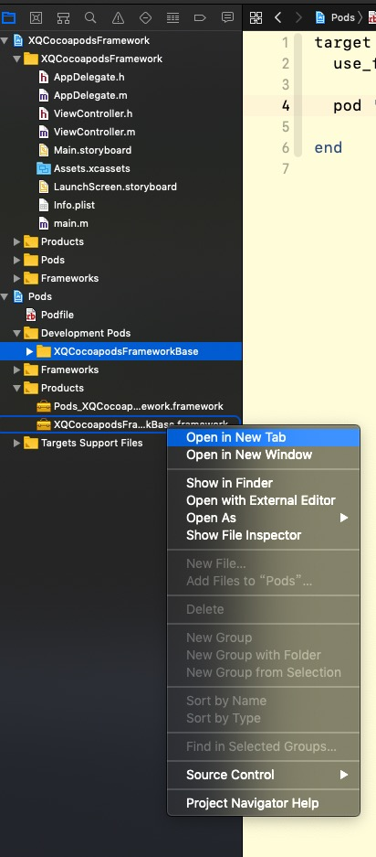

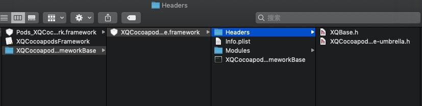

直接Copy一下 .framework 文件, 就能愉快的发给其他小伙伴了!  


使用下来, 我个人觉得的好处如下: 

1. 方便多个Framework一起管理
2. 能直接在项目中测试一下Framework的正确性
3. 能随时修改framework代码, 然后再次运行打包.

> 如果直接修改了framework代码, 并没有增删什么文件的情况下, 可以直接 clear 一下项目, 然后再次 build 项目  
> 就会重新生成新的，已改动的 framework 了


## 打包 .a
如果你需要打包成 .a, 而不是 .framework, 那么只需要改动一点就行了, 把 XQCocoapodsFramework/Podfile 里面的 use_frameworks! 去掉 

```
target 'XQCocoapodsFramework' do
  pod 'XQCocoapodsFrameworkBase', :path => '../XQCocoapodsFrameworkBase'
end
```

然后再次

```
pod install
```

最终效果如图

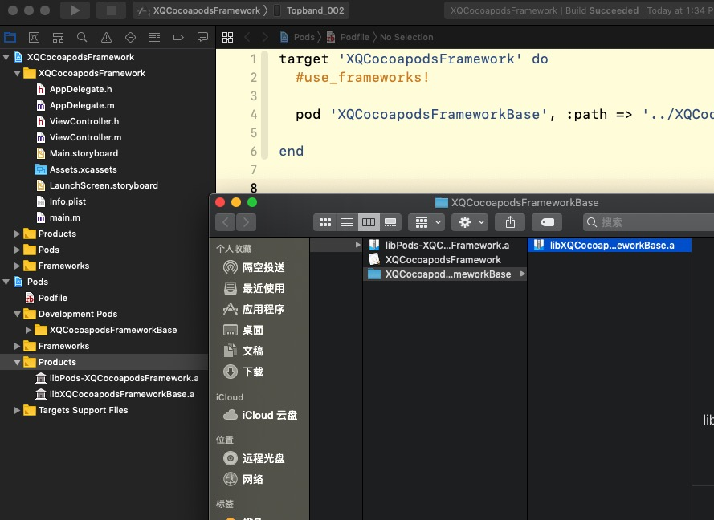


## Debug And Release

注意， 打包里面的代码模式， 是根据你当前项目模式相同的, 如果你需要打Release模式, 要改一下项目当前模式, 如下:  

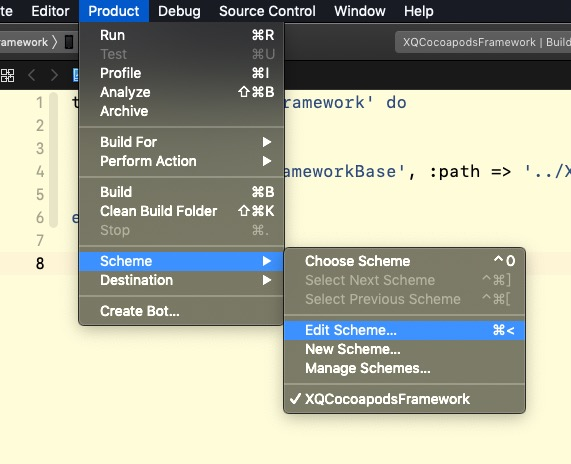

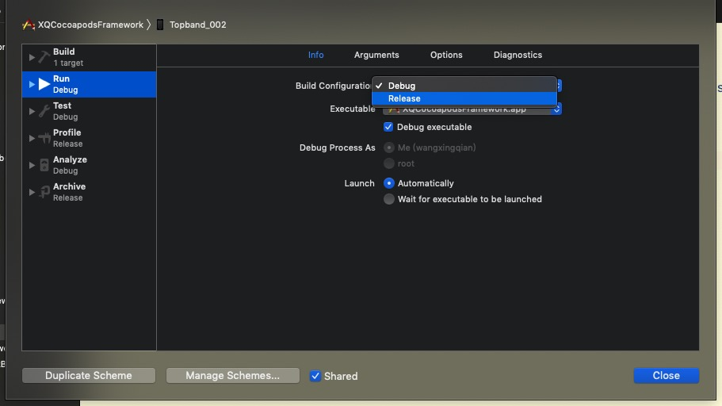


# Framework 的各种姿势


## Framework包含asset, 图片, json, xib等等

我们在创建一个库: XQCocoapodsFrameworkResource

路径如下

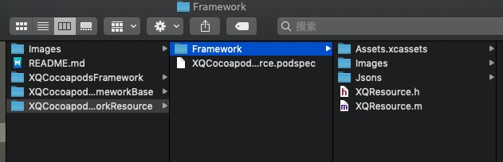


XQCocoapodsFrameworkResource/XQCocoapodsFrameworkResource.podspec 内容
```
Pod::Spec.new do |s|

s.name         = "XQCocoapodsFrameworkResource"      #SDK名称
s.version      = "0.1"#版本号
s.homepage     = "https://github.com/SyKingW/XQProjectTool"  #工程主页地址
s.summary      = "一些项目里面要用到的’小工具’."  #项目的简单描述
s.license     = "MIT"  #协议类型
s.author       = { "Sinking" => "哈哈" } #作者及联系方式

s.ios.deployment_target = "10.0"# iPhone 版本

s.source       = { :git => "https://github.com/SyKingW/XQProjectTool", :tag => "#{s.version}"}   #工程地址及版本号


s.source_files = 'Framework/**/*.{h,m}' # 导入文件
s.resources = 'Framework/**/*.{xcassets,jpeg,json}' # 导入资源文件

end

```

XQResource.m 

```object-c
#import "XQResource.h"

@implementation XQResource

/**
 获取库中图片
 */
+ (UIImage *)imageNamed:(NSString *)name {
    return [UIImage imageNamed:name inBundle:[self bundle] compatibleWithTraitCollection:nil];
}

/**
 获取库中数据路径
 */
+ (nullable NSString *)pathForResource:(nullable NSString *)name ofType:(nullable NSString *)ext {
    return [[self bundle] pathForResource:name ofType:ext];
}

/**
 获取当前库的Bundle
 */
+ (NSBundle *)bundle {
    return [NSBundle bundleForClass:[XQResource class]];
}

@end
```

然后主项目 Podfile 增加 XQCocoapodsFrameworkResource 库, 再 pod install

```
pod 'XQCocoapodsFrameworkResource', :path => '../XQCocoapodsFrameworkResource'
```

这个时候, 我们就已经成功导入项目, 接下来就是验证的时刻了, 如下: 

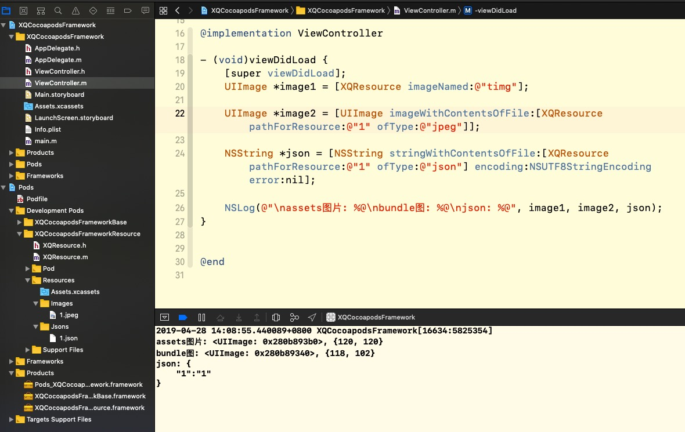


其他什么html, zip, xml, xib, sb都可以类似这样导入. 只要添加后缀就行了

```
s.resources = 'Framework/**/*.{xcassets,jpeg,json,html,zip,xml,xib}' # 导入资源文件
```

不过要注意的是， 获取资源的时候， 要从正确的Bundle中获取.  

> xib, sb不能直接在里面使用图片, 不然你会发现, 运行的时候图片是空白的.   
> 目前没发现太好的解决方法, 我是直接在 View 的 - (void)awakeFromNib 中设置图片


哦, 再上一个打包好framework图吧, 如下:

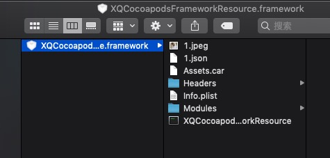


## Framework包含bundle

其实这个Bundle是上面的png, json没太多区别, 不过见太多人问这个, 所以单独分了出来  
我们继续用 XQCocoapodsFrameworkResource 库   

首先增加多一个资源类型文件后缀 XQCocoapodsFrameworkResource/XQCocoapodsFrameworkResource.podspec  

```
s.resources = 'Framework/**/*.{xcassets,jpeg,json,bundle}' # 导入资源文件
```

创建一个.bundle文件, 并且放入图片, 并且放到 XQCocoapodsFrameworkResource 库, 如下

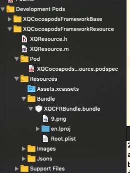


XQResource 类, 增加多一个方法, 获取 XQCFRBundle.bundle

```object-c
/**
 获取 XQCFRBundle.bundle
 */
+ (NSBundle *)cfrBundle {
    NSBundle *b = [NSBundle bundleWithPath:[self pathForResource:@"XQCFRBundle" ofType:@"bundle"]];
    return b;
}
```

我们再更新一下库

```
pod install
```

好, 让我们再次进入验证阶段, 如图: 

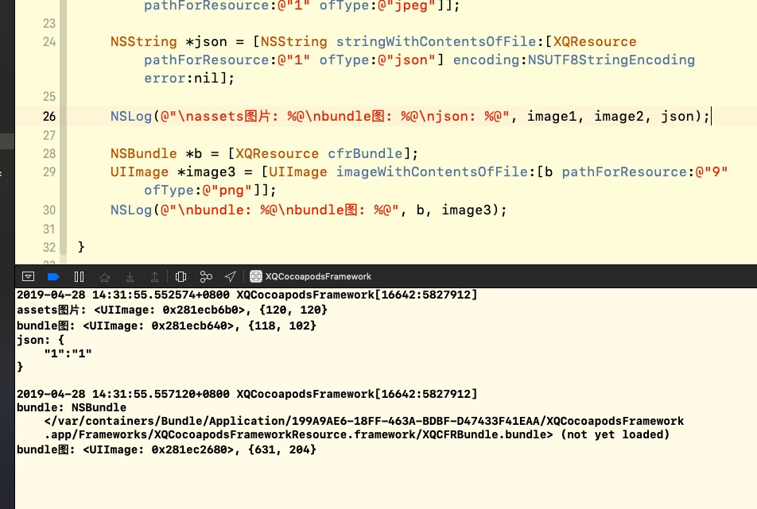

Perfect! ✧(≖ ◡ ≖)  
不出所料, 再次加载出来了资源.

## Framewrok包含MRC文件
有些老库, 或者和C, C++混合的库, 总是不可避免一些 MRC 文件, 但又不想整个库 MRC, 这个时候就很蛋疼了.  
吐槽一下, 博主当时对接那些什么摄像头, 简直头皮发麻, 直接用对方的库, 根本用不了. 明明用了 MRC 又不好好管理内存, 真的烦, 还要自己再撸一遍.

这个就不演示了, 想指定哪些文件 MRC 就直接在 .podspec 里面指定就行  
个人建议, 最好把 MRC 文件放在一个文件夹内, 然后直接指定下面所有文件就行

```
s.non_arc_files = 'Framework/MRC/**/*.{m,mm}' # mrc 文件
```


## Framework包含 .a 文件 或 依赖其他 .framework

### .a

步骤略过, 和上面几个相差不大. ( 其实就是偷懒 \_(:з」∠)_ )   

我看了很多文章, 很多都说, 直接指定 .a 就行了, 如下

```
s.vendored_libraries = 'Framework/**/*.{a}' # 指定 .a 文件
```

确实, 如果你只是自己用, 直接 pod install 是没问题, 但是, 如果你要直接取出 framework 给人家用.  
哦豁, 完了, 人家运行不起来! ( 别问我怎么知道, 再问就删文章 ) 报错如下: 

```
Undefined symbols for architecture arm64:
  "_OBJC_CLASS_$_XXXXXXXXX", referenced from:
      objc-class-ref in XXXXXXXXX.o
ld: symbol(s) not found for architecture arm64
```

大致就是, 在某某地方找不到某某代码.  
这个是什么问题呢? 其实就是 .a 其实是没有导入到 .framework 中的, 而是引用.   
所以, 还要发 .a 文件给小伙伴, 导入到项目中.

### .framework

都和 .a 一样, 要给依赖的 .framework 给人家.  
不过 .framework 一般都会给...因为你不给, .h 都没有.  
.a 文件的坑我就是从 .framework 这边得到启发.
.a 的 .h 是一起的, 才能算完整一个库. 不过我们原本给的 framework 里面已经有 .h 了, 就感觉 .a 应该已经导入进去了, 其实完全不是的, 只是依赖 .a 而已

podspec 字段如下

```
s.vendored_frameworks = 'Framework/**/*.{a}' # 指定 .framework 文件
```


## Framework中引用framework

### 引用已发布到 CocoaPods 平台的第三方

例如要依赖 AFNetworking 和 Masonry , podspec 添加如下: 

```
s.dependency 'AFNetworking'
s.dependency 'Masonry'
```

### 引用自己本地第三方(本地文件, svn, git)

引用没有上传的 CocoaPods 平台的, 需要在主项目里面的 Podfile 也去指定这个库, 例如: 
引用 XQProjectTool 库, git 地址是 https://github.com/SyKingW/XQProjectTool.git 

podspec 如下

```
s.dependency 'XQProjectTool'
```

#### 项目的 Podfile 如下

git 如下

```
pod 'XQProjectTool', :git => 'https://github.com/SyKingW/XQProjectTool.git'  # 指定地址
```

如果是 svn, 如下

```
pod 'XQProjectTool', :svn => 'https://github.com/SyKingW/XQProjectTool'  # 指定地址
```

如果是 本地地址, 如下

```
pod 'XQProjectTool', :path => '../本地库路径'  # 指定地址
```

这样就能关联没有上传到 CocoaPods 的库了.  

> 得保证 svn 或者是 git 是公开的喔, 不是公开的话, 要登录.


# 坑

## image not found

```
dyld: Library not loaded: @rpath/XQCocoapodsFrameworkLib.framework/XQCocoapodsFrameworkLib
  Referenced from: /var/containers/Bundle/Application/B57FD254-BBAA-4C9B-930D-E264935A76F8/XQCocoapodsFramework.app/XQCocoapodsFramework
  Reason: image not found
```

运行时, 报上面的错误, 就让小伙伴把 framework 导入 到Embedded Binaries 即可

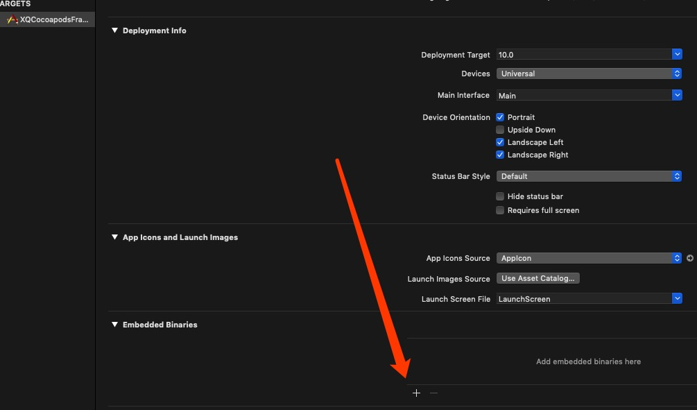

## s.static_framework = true 会出现文件资源只能指定一种的情况

本人亲身踩坑...如果 s.static_framework = true , 那么资源文件就只能指定一个, 你指定多个文件类型, 然而会只保留一个文件类型, 非常蛋疼. ( 当时测了很久, 才找出这个问题所在 )  
最终....没找到解决方法, 不过用了一个间接性的方法解决了该问题, 就是 把资源文件都分离出来, 弄成一个库, 然后用主项目(s.static_framework = true)依赖这个资源库就可以用所有资源了


# 项目地址
照例， 项目地址给出 [Github]() 